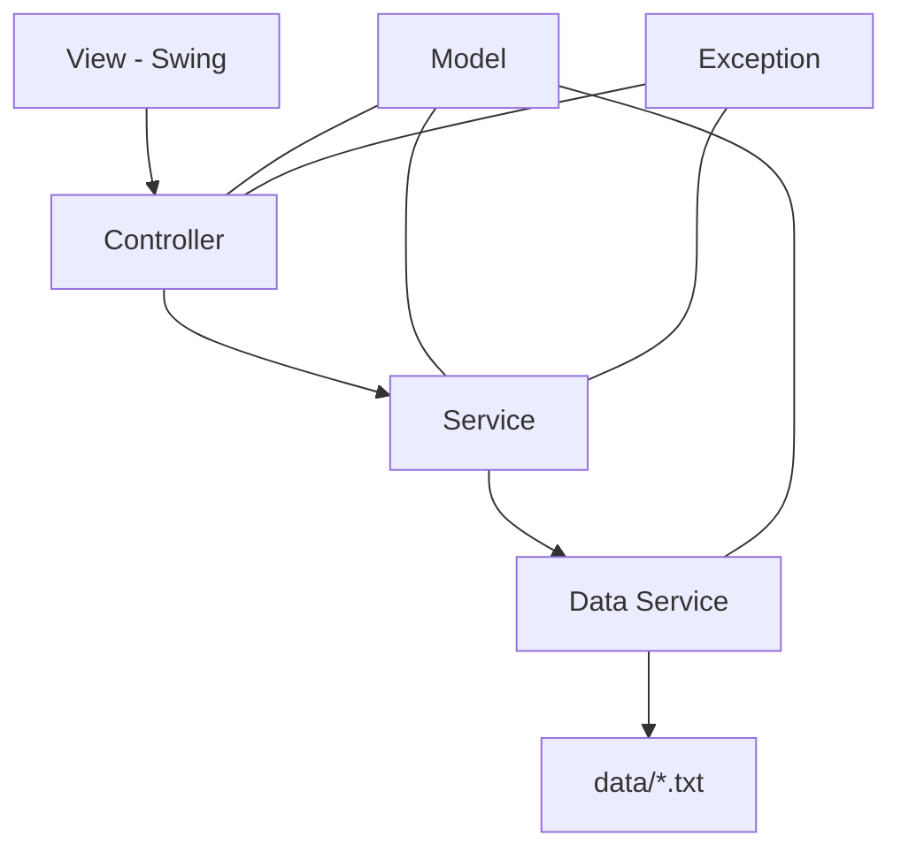

<p align="center">
  
</p>

<h1 align="center">METRO NHỔN TICKET SYSTEM</h1>

Repository: <https://github.com/VanDung279206/MetroNhon-TicketSystem>

## 1. Mục tiêu và phạm vi
bài làm tập trung vào hai tác nhân chính:
| Tác nhân | Vai trò |
|---|---|
| Hành khách | Quản lý tài khoản, ví, vé và lịch sử cá nhân |
| Quản trị viên | Theo dõi tài khoản, vé, lượt sử dụng, hoàn tiền và doanh thu |

## 2. Chức năng

### 2.1. Hành khách

- Đăng ký và đăng nhập
- Xem thông tin tài khoản
- Thay đổi họ tên, số điện thoại và email
- Đổi mật khẩu và đăng xuất
- Nạp tiền demo vào ví Metro
- Xem số dư hiện tại
- Mua vé lượt theo ga đi và ga đến
- Mua vé tháng phổ thông hoặc ưu đãi
- Xem danh sách vé và trạng thái hiệu lực
- Sử dụng vé lượt hoặc vé tháng
- Xem lịch sử các lượt sử dụng
- Hủy vé hợp lệ và nhận tiền hoàn vào ví
- Xem lịch sử hoàn tiền
- Tìm kiếm trong danh sách vé và lịch sử

### 2.2. Quản trị viên

- Xem và tìm kiếm danh sách tài khoản
- Khóa hoặc mở khóa tài khoản hành khách
- Xem danh sách vé đã bán
- Xem số lượt sử dụng của từng vé
- Xem toàn bộ lịch sử sử dụng vé
- Xem toàn bộ lịch sử hủy vé và hoàn tiền
- Theo dõi số tài khoản hoạt động, tổng vé và tổng tiền đã hoàn
- Tính doanh thu thực sau khi trừ tiền hoàn

## 3. Quy tắc nghiệp vụ

### 3.1. Tài khoản và ví

- Tên đăng nhập, số điện thoại và email không được trùng nhau
- Tài khoản bị khóa không thể đăng nhập, mua vé, sử dụng vé hoặc hủy vé
- Số dư không được âm
- Mỗi lần nạp tối đa `10.000.000 VND`
- Hệ thống kiểm tra số dư trước khi thanh toán
- Nếu tạo vé thất bại sau khi trừ tiền, hệ thống thực hiện hoàn tiền

### 3.2. Vé lượt

- Giá vé được tính theo khoảng cách giữa hai ga
  Công thức:

```text
Giá vé = 8.000 + |thứ tự ga đến - thứ tự ga đi| × 1.000 (VND)
```
- Ga đi và ga đến không được giống nhau
- Vé chỉ có hiệu lực trong ngày sử dụng đã lưu
- Vé sử dụng đúng tuyến đã mua và chỉ được dùng một lần
- Sau khi sử dụng, vé được chuyển sang trạng thái không còn hiệu lực

### 3.3. Vé tháng
| Loại vé | Giá |
|---|---:|
| Phổ thông | 280.000 VND |
| Ưu đãi | 140.000 VND |

- Có hai loại: `PHO_THONG` và `UU_DAI - cho những ng lao động, sviên`
- Vé có hiệu lực 30 ngày, tính cả ngày bắt đầu
- Vé được sử dụng nhiều lần giữa hai ga hợp lệ trên tuyến
- Một hành khách chỉ được có một vé tháng còn hiệu lực tại cùng thời điểm
- Hệ thống kiểm tra vé tháng hiện tại trước khi trừ tiền mua vé mới

### 3.4. Hủy vé và hoàn tiền

Đây là quy định demo của đồ án:

| Loại vé | Điều kiện hủy | Tỷ lệ hoàn |
|---|---|---:|
| Vé lượt | Chưa sử dụng và còn hiệu lực | 90% |
| Vé tháng | Chưa có lượt sử dụng và còn hiệu lực | 80% |

- Vé đã dùng, hết hạn hoặc đã hủy không được hoàn tiền
- Mỗi vé chỉ được hoàn một lần
- Vé bị vô hiệu hóa ngay khi hủy thành công
- Tiền được hoàn vào ví của hành khách sở hữu vé
- Giao dịch hủy được lưu để hành khách và admin tra cứu

Các tỷ lệ có thể điều chỉnh tại:

```text
TicketSystem/src/service/HuyVeService.java
```

## 4. Công nghệ sử dụng

| Thành phần | Công nghệ |
|---|---|
| Ngôn ngữ | Java 17 |
| Giao diện | Java Swing |
| Look and Feel | FlatLaf 3.7.2 |
| Quản lý dự án | Maven |
| Lưu trữ | Tệp văn bản UTF-8 |
| Kiểm thử | Các lớp integration/smoke test chạy bằng `main()` |
| Quản lý mã nguồn | Git và GitHub |

## 5. Kiến trúc hệ thống

Ứng dụng được chia thành các tầng độc lập:



| Tầng | Trách nhiệm |
|---|---|
| `view` | Hiển thị giao diện và tiếp nhận thao tác người dùng |
| `controller` | Điều phối luồng giữa giao diện và nghiệp vụ |
| `service` | Xử lý quy tắc mua, dùng, hủy vé, giá vé và ví tiền |
| `data` | Chuyển đổi object và đọc/ghi dữ liệu |
| `model` | Biểu diễn tài khoản, hành khách, ga, vé và lịch sử |
| `exception` | Mô tả các lỗi nghiệp vụ cụ thể |
| `utils` | Cấu hình đường dẫn và thao tác tệp dùng chung |

## 6. Hạn chế hiện tại

- Dữ liệu được lưu trong tệp `.txt`, chưa sử dụng hệ quản trị cơ sở dữ liệu.
- Mật khẩu đang lưu dạng văn bản để phù hợp phạm vi demo của môn học.
- Ví tiền chỉ là mô phỏng, không kết nối ngân hàng hoặc cổng thanh toán.
- Chưa có QR vé và cổng soát vé thực tế.
- Chưa có vai trò nhân viên soát vé.
- Chưa lưu lịch sử riêng cho các giao dịch nạp tiền và thanh toán.
- Chưa hỗ trợ nhiều người dùng ghi dữ liệu đồng thời từ nhiều tiến trình.

## 7. Hướng phát triển

- Chuyển dữ liệu sang MySQL, PostgreSQL hoặc SQLite.
- Mã hóa/hash mật khẩu và bổ sung quy trình quên mật khẩu.
- Thêm lịch sử giao dịch ví.
- Tạo QR cho từng vé và mô phỏng cổng kiểm soát.
- Thêm vai trò nhân viên soát vé.
- Cho admin cấu hình ga, giá vé và tỷ lệ hoàn.
- Thông báo số dư thấp hoặc vé tháng sắp hết hạn.
- Xuất báo cáo doanh thu ra CSV/PDF.
- Bổ sung phân trang cho các bảng dữ liệu lớn.
- Phát triển chức năng mua hộ vé cho hành khách đã đăng ký.

## 8. Thành viên và phân công

| STT | Họ và tên | Mã sinh viên | Công việc chính | chú thích |
|---:|---|---|---|---|
| 1 | Nguyễn Văn Dũng | 2025607310 | Model, Data Service, giao diện và tích hợp | hoàn thành tốt |
| 2 | Nguyễn Khắc Hải | 2024603442 | Controller | hoàn thành tốt |
| 3 | Thành Hoài An | 2024601843 | Service/kiểm thử | hoàn thành tốt |
| 4 | Hà Đức Việt | 2024608060 | Tài liệu/giao diện/kiểm thử | phần giao diện nộp muộn |
